# 🎮 Gnetic Core — Biblioteca de Videojuegos

Gnetic Core es una biblioteca personal de videojuegos que permite registrar, consultar, editar y eliminar títulos de una colección, sistema de calificaciones, comentarios y un panel de administración.

---

## Tabla de contenidos

1. [Descripción general](#descripción-general)
2. [Guía de uso](#guía-de-uso)
   - [Pantalla de inicio](#1-pantalla-de-inicio)
   - [Registro e inicio de sesión](#2-registro-e-inicio-de-sesión)
   - [Vista del usuario](#3-vista-del-usuario)
   - [Agregar o proponer un juego](#4-agregar-o-proponer-un-juego)
   - [Detalle de un juego](#5-detalle-de-un-juego)
   - [Vista del administrador](#6-vista-del-administrador)
   - [Panel de solicitudes pendientes](#7-panel-de-solicitudes-pendientes)
   - [Estadísticas](#8-estadísticas)
3. [Capturas de pantalla](#capturas-de-pantalla)

---

## Descripción general

Gnetic Core implementa un sistema de roles diferenciado:

- **Usuario regular:** puede consultar la biblioteca, calificar juegos, comentar y proponer nuevos registros o ediciones que quedan en espera de aprobación.
- **Administrador:** tiene control total sobre la biblioteca — puede agregar, editar y eliminar juegos directamente, además de aprobar o rechazar las propuestas de los usuarios.

La información se almacena de forma persistente en una base de datos local mediante **Room**, garantizando que los datos se conserven entre sesiones.

---

## Guía de uso

### 1. Pantalla de inicio

Al abrir la aplicación se muestra una pantalla de bienvenida con el nombre y logo de **Gnetic Core** mientras se inicializa la base de datos. Tras unos instantes, la app redirige automáticamente a la pantalla de inicio de sesión.

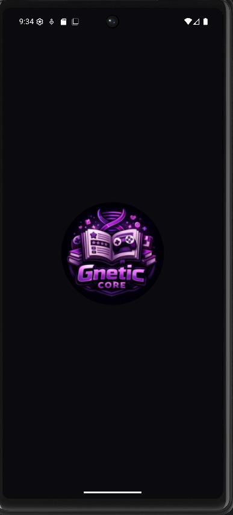

---

### 2. Registro e inicio de sesión

#### Inicio de sesión

Ingresa tu **nombre de usuario** y **contraseña** para acceder. La app detecta automáticamente si la cuenta tiene rol de usuario o administrador y redirige a la vista correspondiente.

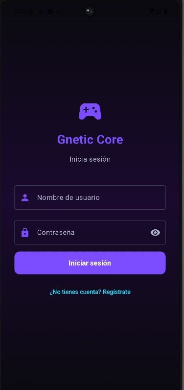

#### Registro de cuenta nueva

Si aún no tienes cuenta, pulsa **¿No tienes cuenta? Regístrate**. Deberás proporcionar:

- **Nombre de usuario** — identificador único para iniciar sesión
- **Identificador público** — nombre que verán otros usuarios
- **Contraseña** — mínimo 4 caracteres
- **Confirmar contraseña** — debe coincidir con la anterior

Todos los campos cuentan con validaciones en tiempo real que muestran mensajes de error si algún dato es incorrecto.

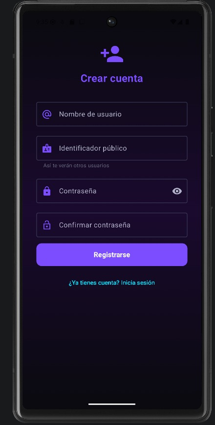

> **Nota:** El usuario de administrador es el siguiente:
> Usuario: `admin`
> Contraseña: `admin123`

---

### 3. Vista del usuario

La pantalla principal del usuario muestra la biblioteca completa de juegos aprobados organizados en cuatro pestañas:

| Pestaña | Descripción |
|---|---|
| **Todos los juegos** | Lista completa ordenada alfabéticamente |
| **Por plataforma** | Juegos agrupados y colapsables por consola/plataforma |
| **Más valorados** | Ordenados por número de reseñas recibidas |
| **Más recientes** | Ordenados por fecha de registro |

Desde la barra superior puedes activar el **buscador** para filtrar juegos por título en tiempo real.

Cada tarjeta de juego muestra:
- Portada (si fue cargada) o emoji representativo de la plataforma
- Título y desarrolladora
- Chips de plataforma, género y año
- Calificación promedio con estrellas

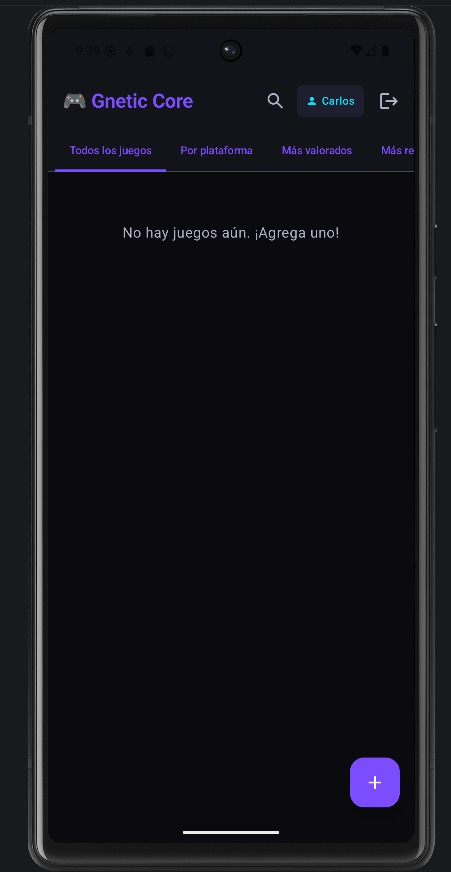

**Por Plataforma**

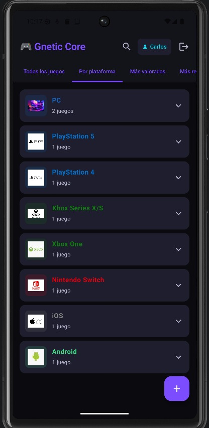

**Más valorados**

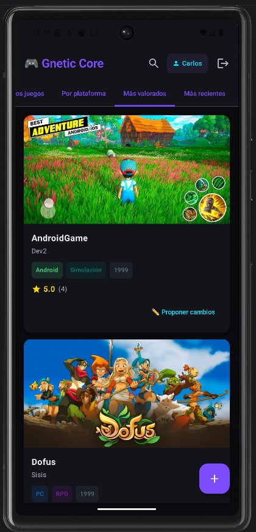

**Más recientes**

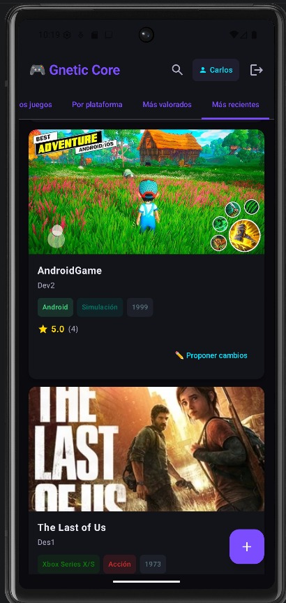

---

### 4. Agregar o proponer un juego

Pulsa el botón **+** (esquina inferior derecha) para abrir el formulario de registro.

#### Campos del formulario

| Campo | Tipo | Validación |
|---|---|---|
| Portada | Imagen de galería (opcional) | — |
| Título | Texto libre | Obligatorio, mínimo 2 caracteres |
| Plataforma | Lista desplegable | Obligatorio |
| Género | Lista desplegable | Obligatorio |
| Año de lanzamiento | Numérico | Obligatorio, entre 1972 y el año actual |
| Desarrolladora | Texto libre | Obligatorio, mínimo 2 caracteres |
| Calificación | Estrellas (1–5) | Obligatorio, mínimo 1 estrella |

#### Plataformas disponibles

PC · PlayStation 5 · PlayStation 4 · Xbox Series X/S · Xbox One · Nintendo Switch · iOS · Android

#### Géneros disponibles

Acción · Aventura · RPG · Estrategia · Deportes · Carreras · Terror · Simulación · Plataformas · Puzzle

> **Nota:** Si accedes como **usuario regular**, el juego se enviará como propuesta para revisión del administrador. Si accedes como **administrador**, el juego se agrega directamente a la biblioteca.

Si se carga una imagen de portada, es posible ajustar el enfoque arrastrando sobre ella para elegir la zona de recorte que se mostrará en la tarjeta.

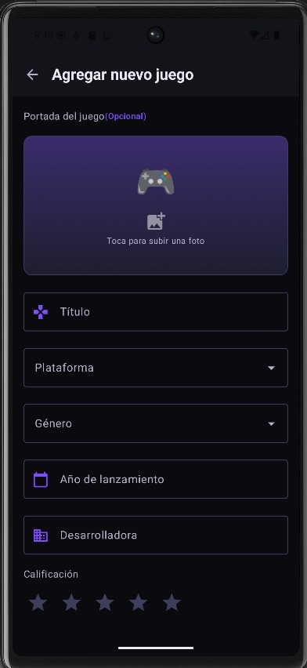

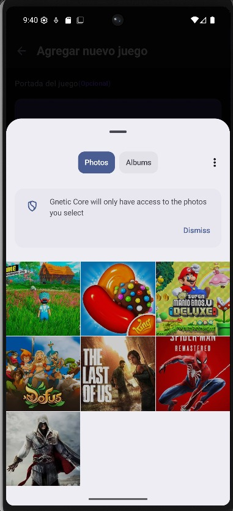

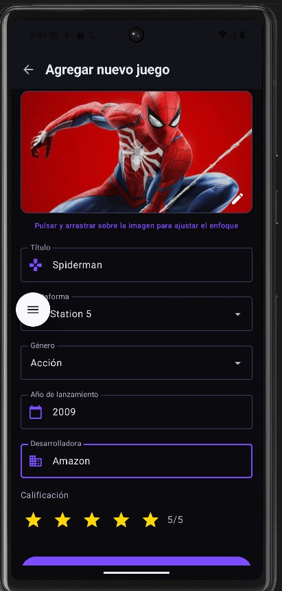

> **Nota:** Si el usuario no agrega una imagen, existen imágenes predeterminadas dependiendo de la plataforma seleccionada.

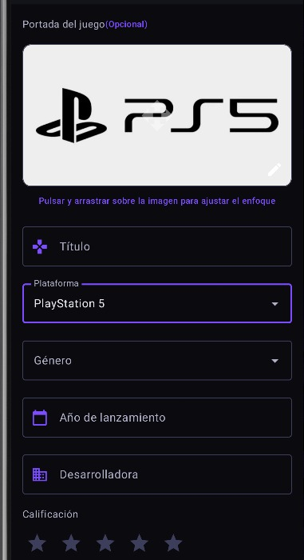

---

### 5. Detalle de un juego

Al pulsar sobre cualquier tarjeta se abre la pantalla de detalle con:

- **Imagen de portada** en tamaño completo
- **Información completa:** título, desarrolladora, plataforma, género, año
- **Calificación promedio** visible en la esquina superior
- **Tu calificación:** selector de estrellas personal (1–5) que contribuye al promedio global
- **Sección de comentarios:** puedes publicar comentarios y responder a los de otros usuarios
- Botón de **proponer edición** (usuarios) o **editar** directamente (administradores)

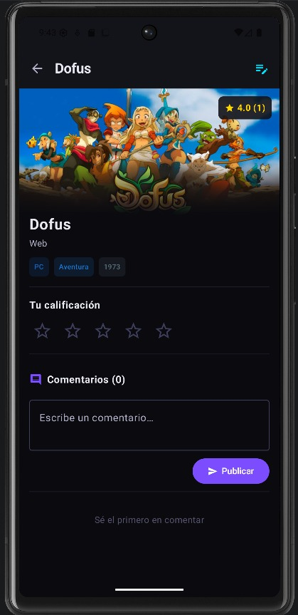

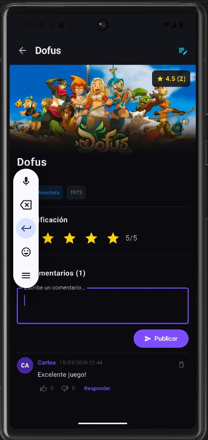

---

### 6. Vista del administrador

El administrador accede a una pantalla equivalente a la del usuario pero con controles adicionales visibles en cada tarjeta:

- ✏️ **Editar** — abre el formulario precargado con los datos actuales del juego
- 🗑 **Eliminar** — muestra un diálogo de confirmación antes de borrar

Un banner morado en la parte superior indica el modo administrador y muestra el número de solicitudes pendientes si las hay.

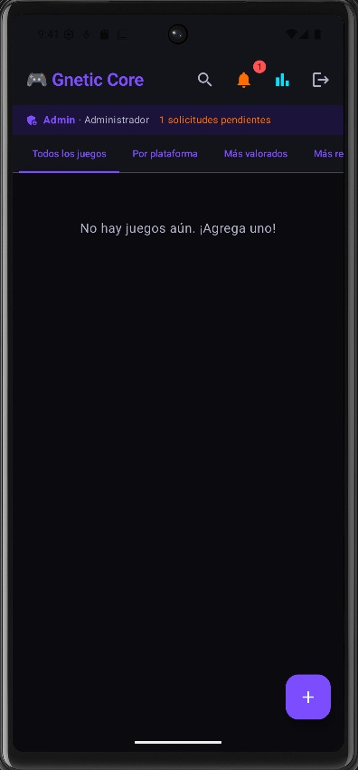

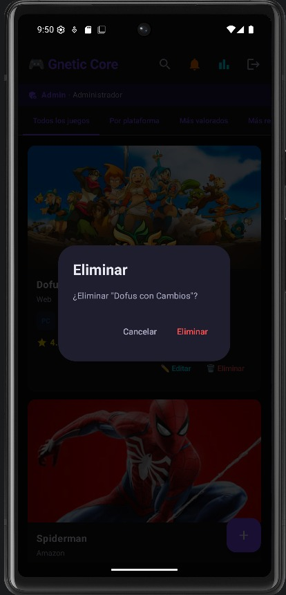

---

### 7. Panel de solicitudes pendientes

Accesible desde el ícono de notificaciones en la barra superior (solo administradores). Muestra todas las propuestas enviadas por usuarios, clasificadas en dos tipos:

- **Nuevo juego** — propuesta de agregar un título que aún no existe
- **Edición de juego** — propuesta de modificar un título existente, con vista comparativa que resalta los campos cambiados

Para cada solicitud el administrador puede:
- ✅ **Aprobar** — aplica los cambios a la biblioteca
- ❌ **Rechazar** — descarta la propuesta

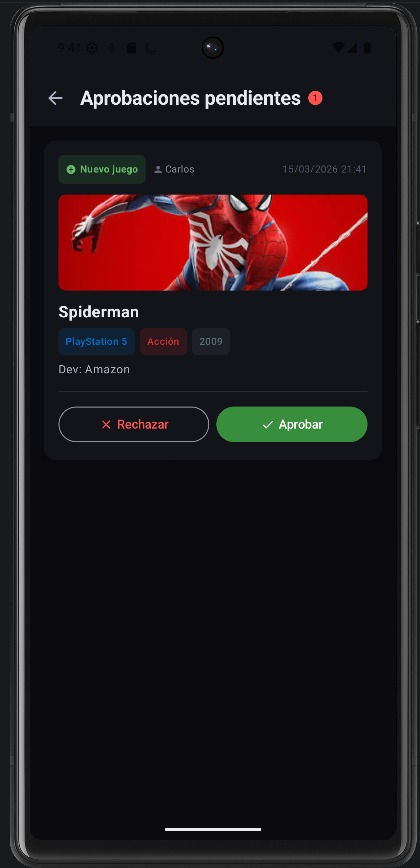

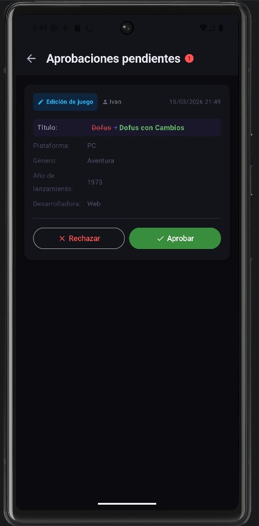

---

### 8. Estadísticas

Accesible desde el ícono de gráfica en la barra superior (solo administradores). Muestra un resumen visual de la biblioteca:

- Total de juegos registrados
- Calificación promedio global
- Distribución de juegos por plataforma (gráfico de barras)
- Distribución de juegos por género (gráfico de barras)

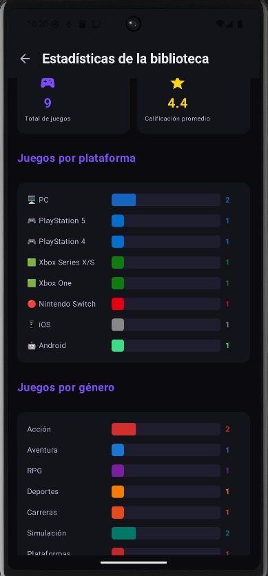

---
